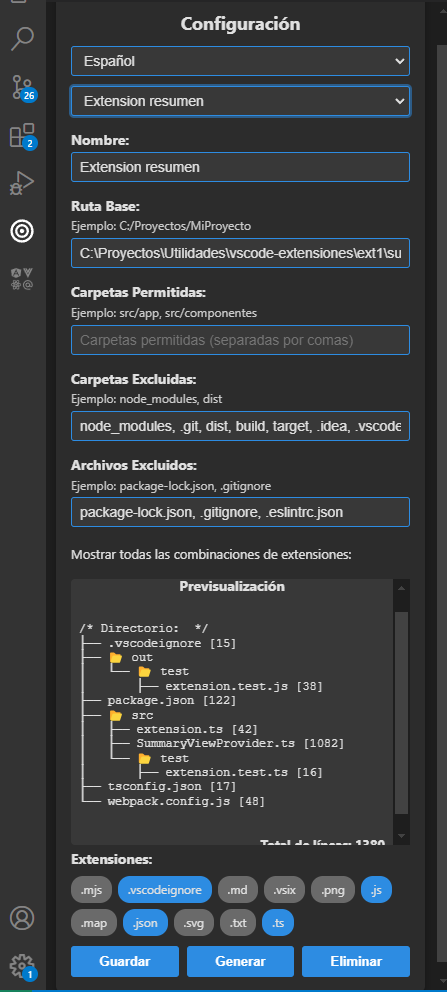

# Extensión de Resumen de Proyecto para VSCode: eDev Summary

## ✨ Propósito

eDev Summary es una extensión para Visual Studio Code que genera un archivo consolidado llamado `RESUMEN.txt`. Este archivo contiene un resumen estructurado y delimitado del contenido de los archivos seleccionados dentro de un proyecto, ideal para:

- Proporcionar contexto rápido a desarrolladores.
- Preparar insumos para herramientas de IA.
- Revisar de forma eficiente la estructura y el contenido del proyecto.

---

## 🔄 Características Principales

### 1. Configuración Flexible

- Especifica la **ruta principal** del proyecto.
- Define carpetas **permitidas** y **excluidas**.
- Excluye archivos específicos o patrones de archivos.

**Ejemplo:**
```json
{
  "name": "Proyecto Frontend",
  "directoryPath": "C:/proyectos/frontend",
  "allowedDirectories": ["src", "public"],
  "excludedDirectories": ["node_modules", "dist"],
  "excludedFiles": ["*.test.js", "config.js"],
  "extensions": [".js", ".css"]
}
```

---

### 2. 📚 Gestión de Configuraciones

- Guarda, carga y elimina configuraciones personalizadas.
- Cambia rápidamente entre diferentes configuraciones.
- Utiliza valores por defecto para exclusiones comunes.

**Directorios excluidos por defecto:**
- `node_modules`, `.git`, `dist`, `build`, `coverage`, `tmp`

**Archivos excluidos por defecto:**
- `.env`, `*.log`, `.DS_Store`, `Thumbs.db`

---

### 3. 🔍 Análisis Dinámico de Extensiones

- Escanea el proyecto y detecta todas las extensiones de archivo.
- Presenta las extensiones como **badges visuales**.
- Permite seleccionar extensiones específicas para incluir en el resumen.

**Ejemplo:**
```
Extensiones detectadas: 🏷 .js  🏷 .css  🏷 .html
Extensiones seleccionadas: ✅ .js  ✅ .css
```

---

### 4. 🔍 Previsualización del Resumen

- Genera una **vista previa** del árbol de archivos y líneas de código antes de crear el resumen.
- Proporciona un conteo total de líneas incluidas.

**Ejemplo:**
```
/* Directorio: src */
├── 📂 components
│   ├── Header.js [42]
│   └── Footer.js [38]
├── 📂 pages
│   ├── Home.js [24]
│   └── About.js [18]

Total de líneas: 122
```

---

### 5. ⏳ Feedback Visual en Tiempo Real

- Indicadores de progreso al analizar extensiones y previsualizar contenido.
- Mensajes de error claros para configuraciones incompletas o directorios vacíos.

---

## 🌐 Interfaz Gráfica Intuitiva

La extensión incluye un panel lateral en VSCode para:

- Seleccionar carpetas y archivos.
- Configurar inclusiones y exclusiones.
- Generar y previsualizar resúmenes.

**Opciones clave:**

1. Ruta del proyecto.
2. Carpetas permitidas y excluidas.
3. Selección de extensiones.
4. Vista previa del árbol de archivos.
5. Botones para guardar, generar y eliminar configuraciones.

---

## 📚 Proceso de Análisis y Generación

1. **Escaneo del Proyecto:**
   - Determina el ámbito basado en carpetas permitidas y excluidas.
   - Respeta las configuraciones de extensiones seleccionadas.

2. **Generación del Resumen:**
   - Crea el archivo `RESUMEN.txt`.
   - Incluye solo los archivos seleccionados con separadores claros:

```
/* Inicio src/components/Header.js */
... contenido del archivo ...
/* Fin src/components/Header.js */
```

3. **Copia Automática:**
   - Copia el contenido del resumen al portapapeles al finalizar.

---

## 📊 Escenarios de Uso

### Escenario 1: Análisis Completo del Proyecto

**Configuración:**
- Ruta del proyecto: `C:/proyectos/frontend`
- Carpetas permitidas: Ninguna (analiza todo).
- Exclusiones: Ninguna.

**Resultado:**
Incluye todos los archivos del proyecto en el resumen.

---

### Escenario 2: Análisis Selectivo

**Configuración:**
- Ruta del proyecto: `C:/proyectos/frontend`
- Carpetas permitidas: `src/components`, `src/pages`
- Directorios excluidos: `src/components/deprecated`
- Archivos excluidos: `*.test.js`

**Resultado:**
Incluye solo archivos relevantes de las carpetas seleccionadas, excluyendo archivos y carpetas no deseados.

---

## ⚙ Configuración Avanzada

- **Integración con Webpack:** Configura y empaqueta la extensión con Webpack para un despliegue eficiente.
- **Soporte Multilenguaje:** Permite cambiar entre diferentes idiomas para la interfaz (Español e Inglés).
- **Validación de Entrada:** Asegura que las configuraciones sean completas antes de generar el resumen.

---

## 🎁 Conclusión

⚡ eDev Summary transforma la forma en que los desarrolladores obtienen visibilidad de sus proyectos al proporcionar un resumen claro y estructurado, optimizando el tiempo y mejorando la comprensión del código.

🔸 **Descubre sus ventajas hoy mismo y simplifica tu flujo de trabajo en VSCode.**
